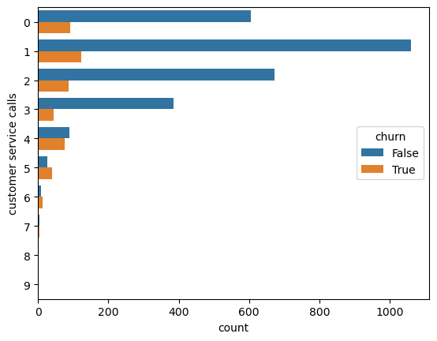

## PREDICTION OF SYRIATEL COMPANY CUSTOMER CHURN
### Overview
Due to increased competition there has been concern for determining the churn rate of customers. Since the market is Dynamic customer have options of switching between different telecommunication companies. By utilzing big data in telecom industry it will be possible to predict the churn rate among the customers in this sector and take measures to curb this problem. Predicting customer churn will help telecommunication firms in solving customer needs and increase its retention rates. 

### Business Understanding
#### Business Problem
Since there is high customer churn rate in telecom industry, Seriatel needs to predict the probability of customer churn rate in order to maintain wide customer base. The company needs to retain existing customer since its costly for Seriatel to lose their loyal customers given that acquring new ones is expensive. Customer churn can have significant financial implications for Seriatel, as it can lead to a loss of revenue, market share, and customer loyalty. Customer churn prediction in this case will involve using dataset of Seriatel and machine learning models to identify customers who are at risk of churn, enabling proactive measures to retain them.
#### Objectives 
* Create machine learning models that can predict customer churn by using data to analyze customer features.
* Comparing the build machine learning models and determine the most accurate model in prediction.  
* The analysis aims to identify the specific features that have a significant impact on the customer churn rate in SyriaTel, provide valuable recommendations based on the findings hence help to mitigate churn rates in the company and improve customer retention.
### Data Understanding 
The project utilizes historical customer data, including demographic information and transactional data of Seriatel telecom company. This data is used to build a predictive model that can classify customers as churned or non-churned. The data has 3333 rows and 21 columns and the company is based in California USA. The colunmn tites are as follows:

- State: The state where the customer resides.
- Area code: The area code associated with the customer's phone number.
- International plan: A binary variable indicating whether the customer has an international calling plan (1) or not (0).
- Voice mail plan: A binary variable indicating whether the customer has a voicemail plan (1) or not (0).
- Number vmail messages: The number of voicemail messages the customer has.
- Total day minutes: The total number of minutes the customer used during the daytime.
- Total day calls: The total number of calls the customer made or received during the daytime.
- Total day charge: The total charges incurred by the customer for daytime usage.
- Total eve minutes: The total number of minutes the customer used during the evening.
- Total eve calls: The total number of calls the customer made or received during the evening.
- Total eve charge: The total charges incurred by the customer for evening usage.
- Total night minutes: The total number of minutes the customer used during the night.
- Total night calls: The total number of calls the customer made or received during the night.
- Total night charge: The total charges incurred by the customer for night usage.
- Total intl minutes: The total number of minutes the customer used for international calls.
- Total intl calls**: The total number of international calls the customer made.
- Total intl charge: The total charges incurred by the customer for international calls.
- Customer service calls: The number of customer service calls made by the customer.
- Churn: A binary variable indicating whether the customer has churned (1) or not (0).
- Total_calls: The total number of calls made or received by the customer across all periods (day, evening, and night).
- Total_charge: The total charges incurred by the customer across all usage periods.
## Data processing 
We checked for missing values, duplicates, categorical and numerical values to ensure that data is clean and in correct formaat for modelling. 
We further removed the class imbalance from the data and standardize to make date Consistent and uniformity of modelling
Hence this proces This was done to ensured that the data is valid,accurate and complete for modelling
## Data Analysis 

 

 

## Modelling
Here we build three models used for predicting customer churn in Seriatel company.
The three models are 
1. Logistic regression which had accuracy level of 81.6% but after cross validation with 5 folds its accuracy improevd to 86.8%.
2. Decision tree classifier was another model which had accuracy level of 90.7% in predicting customer churn and not churn.
3. Finally we build decision tree classifier model which achieved an accracy level of 90.9%.
We picked the most accurate model that is decision tree and tuned the hyperparameter using grid search.
This helped in improving model performance hence tuned random forest model attained accuracy level of 97.45%. 

## Evaluation 
From the above model we concluded that decison tree is the best model for be used by Seriatel in predicting customer churn due to its good perfomance. 
To futher check on the model perfomance we checked drew ROC curve to check for ROC accuracy and area under the curve. Here we found the roc score for logistic regression, decision tree and random forest classifier as 0.79, 0.88 and 0.92 respectively showing that random forest is indeed the best model for predicting customer churn in Seriatel when its parameters are tuned. 

 

From this analysis Seriatel company will be able to: 
1. Make accurate customer churn prediction.
2. Cost savings by developing customer retention strategies. 
3. Ensure that there is customer retention.
4. Develop business strategy and decision making since they will get customer insights and behavior patters. 
